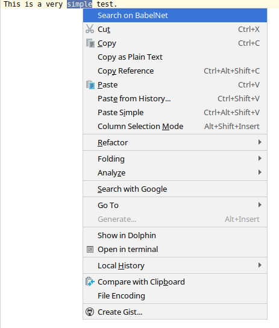
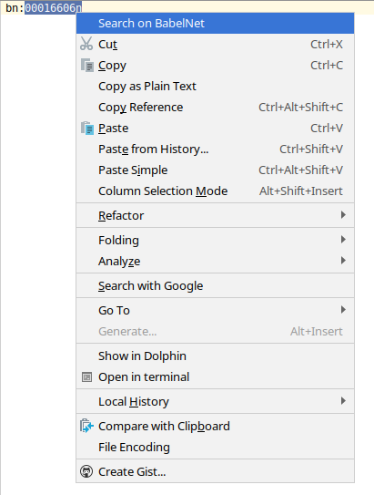

# babelnet-search-plugin

## Plugin for [IntelliJ IDEA](https://plugins.jetbrains.com/plugin/15899-babelnet-searcher) to search a synset or a term on [BabelNet.org](https://babelnet.org/).

Select the term or synset ID (bn:00016606n) that you want to search, click right and in the context menu click on Search on BabelNet. A browser with your search results will be opened.

## Screenshots

